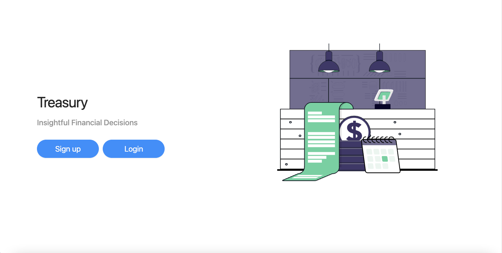

<h1 align="center">Treasury</h1>

Smarter tools to monitor financial accounts.

<p align="center">
    
</p>

---

### Installation

```
# Clone this repository
git clone https://github.com/ShaivPandya/budgeting-app.git
# Go into the repository
cd budgeting-app
```

### Set up client

```
# Go into client folder
cd client
# Install client dependencies
yarn install
# Start client on localhost:3000
yarn start
```

